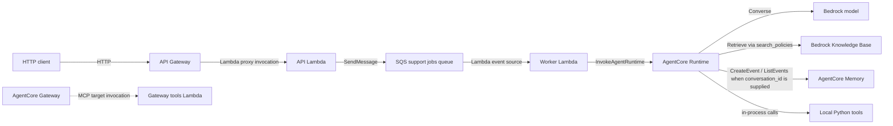

# Runtime dependencies

This document separates calls made by deployed application code from relationships
that exist only to provision or connect infrastructure.

## Runtime communication

The solid API-to-runtime path is the active support-job flow. The Gateway and its
tools Lambda are deployed and callable as a separate MCP path, shown dashed, but no
application code currently calls that Gateway. The agent's Bedrock tool-use loop
instead dispatches `get_order`, `get_customer`, `cancel_order`, and
`search_policies` to local Python functions in the AgentCore Runtime process.

Memory access is implemented by the AgentCore Runtime when an invocation contains a
`conversation_id`. The current API job and worker invocation do not supply one, but
the runtime entrypoint supports direct callers that do.

| Runtime | Dependency | Mechanism | Required configuration | IAM permission |
| --- | --- | --- | --- | --- |
| API Gateway | API Lambda | HTTP API Lambda proxy integration | None in application environment | `lambda:InvokeFunction` resource permission for API Gateway |
| API Lambda | SQS support jobs queue | boto3 `sqs.send_message` | `SUPPORT_JOBS_QUEUE_URL`; optional `SERVICE_NAME`, `APP_ENV`, `LOG_LEVEL` | `sqs:SendMessage` (the CDK queue grant also includes `sqs:GetQueueAttributes` and `sqs:GetQueueUrl`) |
| SQS support jobs queue | Worker Lambda | Lambda SQS event-source mapping and partial-batch response | No worker environment variable for the queue | Worker role: `sqs:ReceiveMessage`, `sqs:DeleteMessage`, `sqs:ChangeMessageVisibility`, `sqs:GetQueueAttributes`, `sqs:GetQueueUrl` |
| Worker Lambda | AgentCore Runtime | boto3 `bedrock-agentcore.invoke_agent_runtime` using the `DEFAULT` qualifier | `AGENTCORE_RUNTIME_ARN`; optional `SERVICE_NAME`, `APP_ENV`, `LOG_LEVEL` | `bedrock-agentcore:InvokeAgentRuntime` on the runtime and its `DEFAULT` endpoint |
| AgentCore Runtime | Bedrock model | boto3 `bedrock-runtime.converse` | `BEDROCK_MODEL_ID`; optional runtime metadata: `SERVICE_NAME`, `APP_ENV`, `LOG_LEVEL` | `bedrock:InvokeModel` on the configured foundation model |
| AgentCore Runtime | Bedrock Knowledge Base | Local `search_policies` tool calls boto3 `bedrock-agent-runtime.retrieve` | `KNOWLEDGE_BASE_ID` | `bedrock:Retrieve` on the knowledge base |
| AgentCore Runtime | AgentCore Memory | boto3 `create_event` and `list_events`, conditional on `conversation_id` | `AGENTCORE_MEMORY_ID` | `bedrock-agentcore:CreateEvent`, `bedrock-agentcore:ListEvents` on the memory |
| AgentCore Runtime | Local agent tools | In-process Python registry and executor | None beyond the KB setting used by `search_policies` | None for in-memory order/customer tools; KB permission as above for policy search |
| AgentCore Gateway | Gateway tools Lambda | MCP Gateway target invokes Lambda | No application environment variables; target stores the Lambda ARN and inline tool schema | Gateway service role: `lambda:InvokeFunction` on the tools Lambda |
| Gateway tools Lambda | In-memory order data | Direct Python `get_order` call | None | No service permission beyond Lambda basic logging |

## Infrastructure-only relationships

These relationships affect provisioning, storage, failure handling, or permissions;
they are not additional calls made by the API, worker, or AgentCore application code.

- The support jobs queue has a dead-letter queue with `maxReceiveCount` 5.
- The worker construct receives the queue to create its event-source mapping; it does
  not receive the queue URL as application configuration.
- The Knowledge Base uses an S3 source bucket, an S3 Vectors index, and the Titan
  embedding model. Those are operated by the Bedrock Knowledge Base service role,
  not directly by the application runtimes.
- The AgentCore Runtime artifact is stored in the CDK bootstrap asset bucket, and
  CDK supplies its standard logging, metrics, tracing, and workload-token permissions.
- The Gateway target associates the standalone Gateway with the tools Lambda and
  grants the Gateway service role permission to invoke it. This association does not
  connect the AgentCore Runtime to the Gateway.
- API Gateway routes, Lambda permissions, CloudWatch log groups, and IAM roles are
  deployment wiring around the runtime calls listed above.
